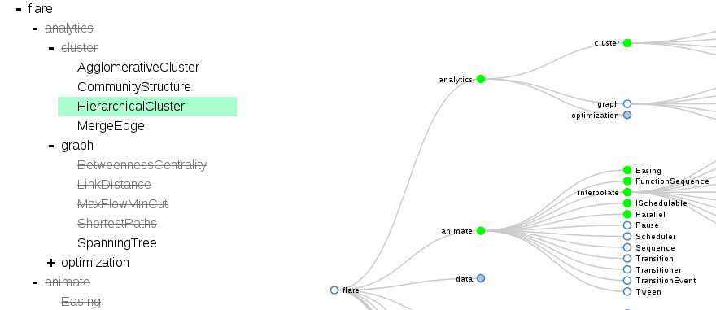

# Treed
A Powerful Tree Editing Component

Treed wants to be for tree editing what ace is for text editing. Extensible, customizible, powerful, and just plain easy to use. Perhaps that's a little ambitious, but that's the idea.

[Play with a demo](http://jaredly.github.io/treed/)

## Features

### Keyboard navigation
I'm a vim user, so there are a lot of vim navigation commands that work out of the box, as well as more normal commands for everyone else.

<table id="bindings">
      <thead>
        <tr>
          <th>Action</th>
          <th>Bindings</th>
        </tr>
      </thead>
      <tbody>
        <tr><td>Navigation</td><td class="binding">arrow keys, hjkl</td></tr>
        <tr><td>Indent/Dedent</td><td class="binding">tab, shift tab</td></tr>
        <tr><td>Collapse/Expand</td><td class="binding">alt + left/right alt + h/l z (toggle)</td></tr>
        <tr><td>Undo/Redo</td><td class="binding">ctrl + z, ctrl + shift + z, u, R</td></tr>
        <tr><td>Move Node</td><td class="binding">ctrl + alt + arrow / hjkl</td></tr>
        <tr><td>Edit mode</td><td class="binding">return, f2, a, A, i, I</td></tr>
        <tr><td>Normal Mode</td><td class="binding">escape</td></tr>
        <tr><td>Toggle Done</td><td class="binding">ctrl + return</td></tr>
        <tr><td>New Node</td><td class="binding">o, O (before) return (in insert mode)</td></tr>
        <tr><td>Cut/Copy/Paste</td><td class="binding">ctrl + x / delete, ctrl + c, ctrl + v</td></tr>
      </tbody>
      </table>

There are several more as well.

### Modularity
Treed is constructed using the MVC pattern such that it is simple to, for example, create an entirely different view for the tree.

You can also create your own "Node" class if you wanted to do more than just have a single text input. You could add buttons, more fields, whatever you want.

### Undo/Redo
It works. Unlimited undo.

## Still under development
I made this version in a weekend, so there are still some things to do :)

- drag and drop
- multi-line select
- api docs
- testing (js + browser)

